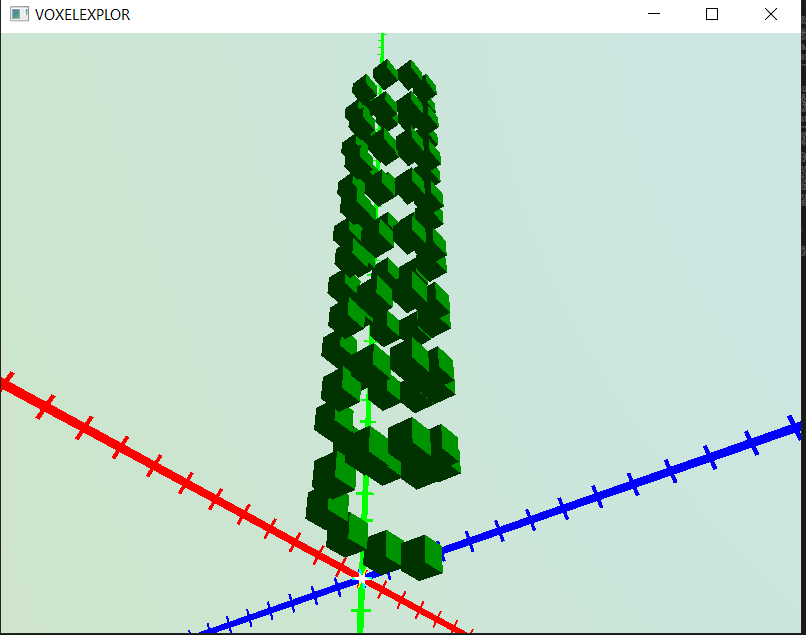

## VOXEL EXPLORE

VOXEL EXPLORE is a voxel renderer, written in Rust and Vulkan for studying rendering algorithms and performance optimizations. This project intends to take a quantitative approach to maximizing voxel graphics performance; the goal is to draw and update as many voxel cubes as possible!

I am inspired by Unreal's Nanite voxel engine, and John Lin's voxel renderer [devblogs](https://voxely.net/blog/the-perfect-voxel-engine/) and [youtube videos](https://www.youtube.com/watch?v=8ptH79R53c0), and also, many, many other voxel renderer devbloggers on youtube. I am not going for a blocky and elementary-looking Minecraft-esque visual style. I want to take things a bit further and go for micro- or nano-scale voxels. My core reasons for working on this are:

1. To deepen my engineering craft, practice coding something sophisticated, and get a better understanding of Rust programming and GPU computing. I want to experience for myself the practical constraints and tradeoffs of drawing frames in realtime. 

2. To test bed both my own exotic algorithmic ideas and also any of the numerous rendering tips shared by both academia and youtubers. The subject of voxel rendering possesses quite a lot of existing technical content to draw on for inspiration.

3. To synthesize these rendering ideas into one engine project, implement them concretely, and document empirical results to share with the voxel rendering dev community.

### Project status

Screenshot:

Currently, as of `master` commit 6118e8, this project has:

- A 3D mesh rendering application with Vulkan, following the C++ [Vulkan Tutorial](https://vulkan-tutorial.com/Introduction) except I wrote it in Rust using [ash](https://docs.rs/ash/latest/ash/index.html) for Rust-idiomatic Vulkan bindings.
    - So that the engine can be vertically integrated for the voxel use case, VOXEL EXPLORE does not depend on any external engine. It handles everything on its own. It handles parallel frame rendering using a swapchain and the necessary synchronization primitives. It allocates GPU memory for buffers and images and governs data layouts. It configures the GPU graphics pipeline and loads it with custom vertex and fragment shaders. Et cetera. The GPU doesn't do anything I don't tell it to. This way, I have no locked-in technical drag inherited from an third-party engine. And, full vertical integration benefits experiment reproducibility.

- No Vulkan validation errors, in my experience. Window maximize/minimize/resize work and behaves well. Minimizing causes the app to sleep.

- An interactive 3D debug scene with a player-controlled camera that can look around and move/fly up/down/left/right. The debug scene uses a small custom shader for a procedurally colored skybox atmosphere and axis lines with tick marks, for position reference. 

- Of course, voxels! With diffuse lighting implemented in another small custom shader.

Additionally, I have one debut devblog in [tmasj/devblogs](https://github.com/tmasj/devblogs), titled `instancing.md`. This devblog describes *instanced rendering*, and explains how to implement it in terms understandable for readers of the Vulkan Tutorial. The Vulkan Tutorial explicitly skips instancing, but it's essential for voxels specifically and a few other purposes.

### Voxels -- Why?

Intrinsically, voxel drawing breaks up 3D geometry into small, discrete cubes as chosen primitive. Rather than develop a bespoke mesh, texture, normal/UV map, and material for each game asset, the voxel paradigm encourages assembling whatever you need from blocky primitives. This enables game interactions you cannot do with polygon engines, like destructible environments.

The thing is though, despite the voxel renderer space being so crowded with attempts, the space as a whole remains 'unsolved generally'. The approach to break up a reasonably sized scene into micro-scale or nano-scale voxels bites you at one significant hurdle: **memory scaling**. Suppose a voxel needs, at best, a byte or two of GPU memory and bandwidth. Even just this amount of memory is serious, since the number of voxels you need to densely fill a volume scales cubically. A GPU is powerful, but it is not a god, and most desktops are limited to 4-8GiB of GPU memory. The cube root of the number of bytes in 4GiB (4,294,967,296) is 1625. Centimeter-scale voxels, at 1 byte per voxel, give you only 16 cubic meters of dense voxel information, if naively implemented. That's about the size of a two-car garage--with no memory left over for lighting, fluid dynamics, creature AI, etc.

The good news is that, in practice, you are not loading or editing 4,294,967,296 fresh voxels every frame, so if you are economical with updates and smart with caching (and sparse datastructures, culling occluded faces, LOD mipmapping, stochastic sampling, etc), there is still hope for the medium.

Perhaps you, like me, are attracted to the technical challenge. Voxel graphics, and computer graphics generally, is one of the deepest and most nuanced tradeoff spaces in engineering--a natural appeal for engineering-minded indies.

### Development

After cloning, run

`mise en -s <desired-shell>`

This will install the dev dependencies in a [mise](https://mise.jdx.dev/) environment. Then,

`mise run develop`

for repo setup. This is run automatically before build/run.

Then,

`mise run build` or `mise run run`

for building/running. 

**OS Support**: I added mise for a place to keep dev dependencies. However, some system deps are not currently tracked by mise; on your system you will need the Vulkan SDK, rust, and msvc buildtools (Windows) or some CMake distribution (other). This project is intended to be developable cross-platform, but currently I have only tried it on Windows, so Linux/OSX MMV. 

**Controls**: WASD to move, plus Space for up and Shift for down. Drag mouse to look around. Press Tab to toggle cursor mode to free the mouse cursor.